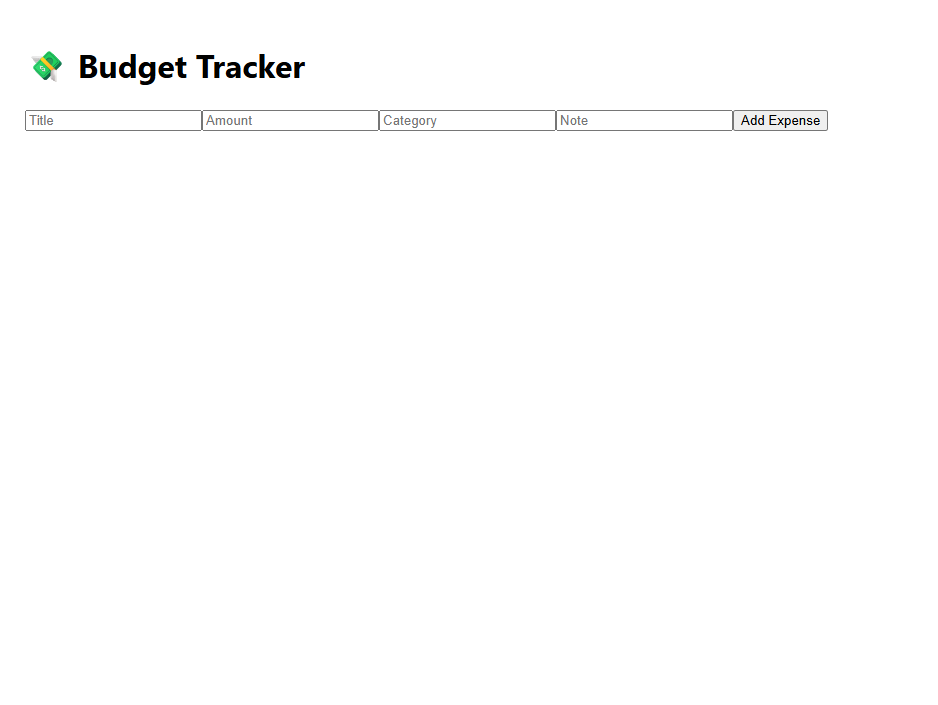

# Getting Started with Create React App

This project was bootstrapped with [Create React App](https://github.com/facebook/create-react-app).

## Available Scripts

In the project directory, you can run:

### `npm start`

Runs the app in the development mode.\
Open [http://localhost:3000](http://localhost:3000) to view it in your browser.

The page will reload when you make changes.\
You may also see any lint errors in the console.

### `npm test`

Launches the test runner in the interactive watch mode.\
See the section about [running tests](https://facebook.github.io/create-react-app/docs/running-tests) for more information.

### `npm run build`

Builds the app for production to the `build` folder.\
It correctly bundles React in production mode and optimizes the build for the best performance.

The build is minified and the filenames include the hashes.\
Your app is ready to be deployed!

See the section about [deployment](https://facebook.github.io/create-react-app/docs/deployment) for more information.

### `npm run eject`

**Note: this is a one-way operation. Once you `eject`, you can't go back!**

If you aren't satisfied with the build tool and configuration choices, you can `eject` at any time. This command will remove the single build dependency from your project.

Instead, it will copy all the configuration files and the transitive dependencies (webpack, Babel, ESLint, etc) right into your project so you have full control over them. All of the commands except `eject` will still work, but they will point to the copied scripts so you can tweak them. At this point you're on your own.

You don't have to ever use `eject`. The curated feature set is suitable for small and middle deployments, and you shouldn't feel obligated to use this feature. However we understand that this tool wouldn't be useful if you couldn't customize it when you are ready for it.

## Learn More

You can learn more in the [Create React App documentation](https://facebook.github.io/create-react-app/docs/getting-started).

To learn React, check out the [React documentation](https://reactjs.org/).

### Code Splitting

This section has moved here: [https://facebook.github.io/create-react-app/docs/code-splitting](https://facebook.github.io/create-react-app/docs/code-splitting)

### Analyzing the Bundle Size

This section has moved here: [https://facebook.github.io/create-react-app/docs/analyzing-the-bundle-size](https://facebook.github.io/create-react-app/docs/analyzing-the-bundle-size)

### Making a Progressive Web App

This section has moved here: [https://facebook.github.io/create-react-app/docs/making-a-progressive-web-app](https://facebook.github.io/create-react-app/docs/making-a-progressive-web-app)

### Advanced Configuration

This section has moved here: [https://facebook.github.io/create-react-app/docs/advanced-configuration](https://facebook.github.io/create-react-app/docs/advanced-configuration)

### Deployment

This section has moved here: [https://facebook.github.io/create-react-app/docs/deployment](https://facebook.github.io/create-react-app/docs/deployment)

### `npm run build` fails to minify

This section has moved here: [https://facebook.github.io/create-react-app/docs/troubleshooting#npm-run-build-fails-to-minify](https://facebook.github.io/create-react-app/docs/troubleshooting#npm-run-build-fails-to-minify)

# 💸 Budget Tracker Frontend

A React-based frontend that connects to a Node.js + MongoDB backend, allowing users to track and view personal expenses in real time.

---

## 🚀 Live Demo

> _This app runs locally and connects to a backend API on `localhost:5000`._

---

## 🔧 How It Works

- React hooks (`useState`, `useEffect`) manage frontend state and handle API interactions.
- The frontend fetches expense data from the backend (`GET /api/expenses`) and displays it in a clean list.
- Users can submit new expenses via a form, which triggers a `POST` request to the backend (`POST /api/expenses`).
- Once saved in MongoDB, the new expense is immediately shown on screen.

---

## 🧱 Project Structure

budget-frontend-react/ ├── src/ │   ├── App.js          # Main component (form + expense list) │   ├── index.js        # React root │   ├── App.css         # Basic styling │   └── ... ├── public/ │   └── index.html      # HTML template ├── package.json        # Project config and dependencies ├── README.md


---

## 🧪 Sample Data Flow

**Frontend form submits:**
```json
{
  "title": "Coffee",
  "amount": 3.75,
  "category": "Food",
  "note": "Iced vanilla latte"
}

Sent to backend:
POST http://localhost:5000/api/expenses
Backend responds:
New expense document saved in MongoDB and returned to frontend → displayed live.

A React-based frontend that connects to a Node.js + MongoDB backend, allowing users to track and view personal expenses in real time.

---

## 🚀 Live Demo

> _This app runs locally and connects to a backend API on `localhost:5000`._

---

## 🔧 How It Works

- React hooks (`useState`, `useEffect`) manage frontend state and handle API interactions.
- The frontend fetches expense data from the backend (`GET /api/expenses`) and displays it in a clean list.
- Users can submit new expenses via a form, which triggers a `POST` request to the backend (`POST /api/expenses`).
- Once saved in MongoDB, the new expense is immediately shown on screen.

---

## 🧱 Project Structure


budget-frontend-react/ ├── src/ │   ├── App.js          # Main component (form + expense list) │   ├── index.js        # React root │   ├── App.css         # Basic styling │   └── ... ├── public/ │   └── index.html      # HTML template ├── package.json        # Project config and dependencies ├── README.md           # You're reading it

---

## 🧪 Sample Data Flow

**Frontend form submits:**
```json
{
  "title": "Coffee",
  "amount": 3.75,
  "category": "Food",
  "note": "Iced vanilla latte"
}

Sent to backend:
POST http://localhost:5000/api/expenses
Backend responds:
New expense document saved in MongoDB and returned to frontend → displayed live.

🛠️ Built With
- React
- Fetch API
- Node.js + Express (Backend)
- MongoDB Compass

🗂️ Backend Repo
🔗 budget-backend

🧠 What I Learned
- How to connect a frontend to a REST API using fetch
- Managing form state and re-rendering dynamically with React
- Handling asynchronous data with useEffect and error logging
- Structuring a full-stack project for clean collaboration and deployment

💡 Next Steps
- Add form validation and error messages
- Style the UI with Tailwind or styled-components
- Add charts or summary stats using Chart.js or Recharts
- Deploy the frontend to Vercel or Netlify

## 📸 Screenshots

Here’s what the app looks like in action:


